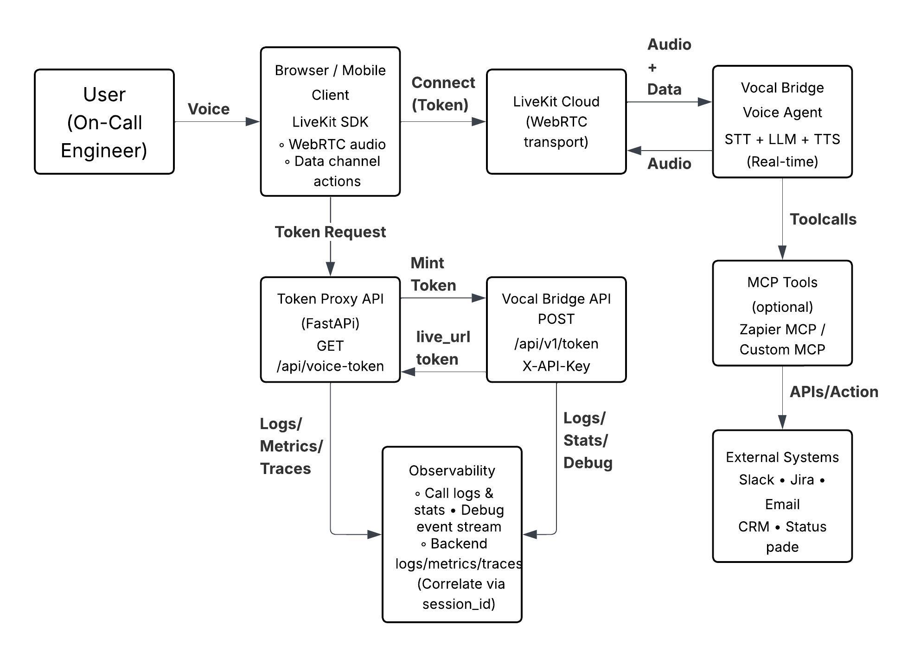

# VoiceOps Bridge

A voice-first incident triage copilot built on Vocal Bridge + LiveKit, designed with explicit decision boundaries, production-grade observability, and failure handling.

VoiceOps Bridge focuses on **architectural rigor and operational maturity** rather than UI polish, demonstrating how voice-driven AI systems can safely support real-world incident response.

---

## What it does

- Enables an on-call engineer to speak with an AI voice agent from the browser or phone (WebRTC / LiveKit).
- Translates unstructured voice input into structured incident artifacts: severity, checklist, timeline, and status update.
- Allows the agent to trigger **structured client actions** (e.g., open runbooks, show checklists) via LiveKit data-channel events.
- Optionally integrates with external systems (Slack, Jira, email) via MCP tools for post-incident follow-ups.
- Enforces **explicit guardrails**, **auditability**, and **failure-aware behavior** throughout the flow.

---

## Hackathon Context & Technical Leadership

This project was developed and presented during an **invitation-only hackathon with a selective participant pool**.

**Role and scope**
- Acted as a principal engineer, focusing on system design, decision boundaries, observability, and failure handling.
- Independently designed the end-to-end architecture and safety guardrails.
- Prioritized production-grade concerns (safety, auditability, failure modes) over feature breadth or UI polish.

**Evaluation focus**
- Architectural clarity and correctness
- Safety and decision boundaries for AI-driven systems
- Operational observability and post-incident accountability
- Failure handling under degraded or uncertain conditions

The implementation intentionally emphasizes **design judgment and operational maturity** rather than application completeness.

---

## Architecture



**High-level flow**
- Voice audio and structured events are exchanged in real time over LiveKit.
- A backend token proxy mints short-lived session tokens, keeping API keys server-side.
- Each voice session is treated as an **auditable trace**, with a stable `session_id` propagated across components.
- Optional MCP tools allow controlled interaction with external systems after the call completes.

---

## Repository structure

```text
voiceops-bridge/
  backend/                 # Token proxy + demo API (FastAPI)
  frontend/                # Minimal browser client using livekit-client
  docs/
    architecture.png       # Blog-ready architecture diagram
    architecture.mmd       # Mermaid source
    system-design.md
    decision-boundaries.md
    observability.md
    failure-handling.md
  tools/
    observe_vb_logs.py     # Optional helper for inspecting call logs/metrics
